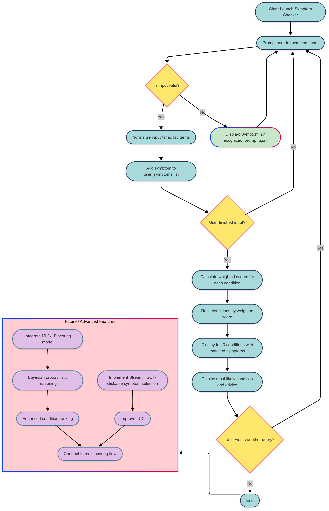
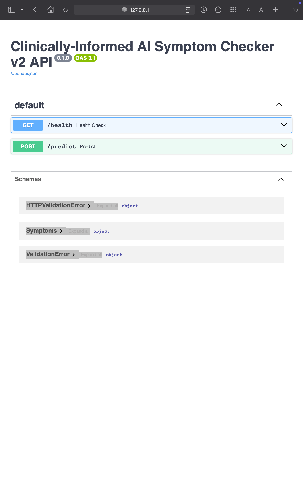
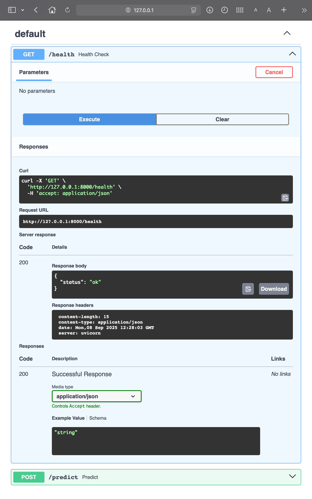
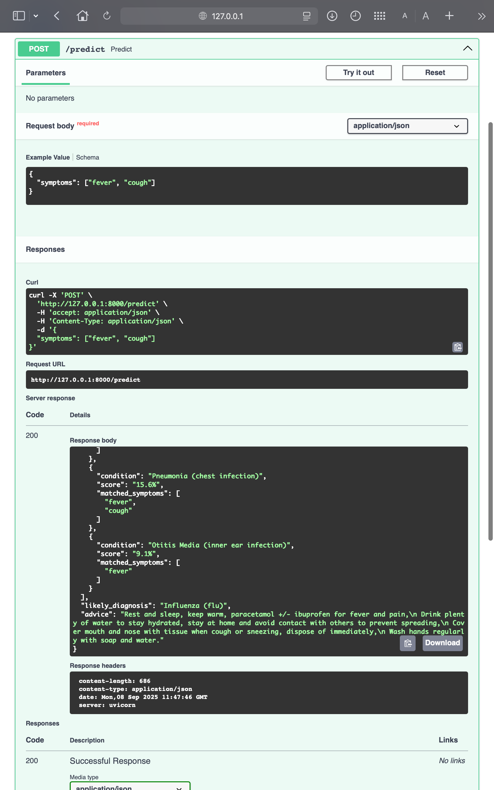

# 𝐁𝐮𝐢𝐥𝐝𝐢𝐧𝐠 𝐚 𝐑𝐮𝐥𝐞-𝐁𝐚𝐬𝐞𝐝 𝐏𝐲𝐭𝐡𝐨𝐧 𝐀𝐈 𝐒𝐲𝐦𝐩𝐭𝐨𝐦 𝐂𝐡𝐞𝐜𝐤𝐞𝐫 🧠🤖
**Python | Rule-based AI | CLI Tool | FastAPI | Pydantic | JSON Output | Clinically-Informed Logic**

<!-- Tech Stack -->
 
 
 

 


<!-- CI/CD & Quality -->
  


<!-- Deployment -->
[](https://ai-symptom-checker-5rfb.onrender.com/docs) 


<!-- Repository Info -->
 
 
 
 


A **Python-based, rule-driven AI symptom checker** that leverages **clinical reasoning** to interpret patient-reported symptoms and rank potential conditions. Users can interact via a **command-line interface (CLI)** **or** a **FastAPI-based JSON API (v2)**, making the tool both scriptable and deployable for web integration.

The **v2 API is live on Render** ([click here to try](https://ai-symptom-checker-5rfb.onrender.com/docs)) and continuously validated via GitHub Actions to ensure endpoints respond correctly.

The **v2 upgrade adds a deployable API**, allowing the system to serve JSON responses for top conditions, matched symptoms, and management advice—demonstrating production-ready backend capabilities alongside the original CLI.

The system outputs the **top 3 likely conditions**, including **matched symptoms** and **management advice** for the most probable diagnosis.

This project demonstrates a **clinically-informed workflow**, where condition-symptom mappings and formula-weighted scoring reflect real-world clinical prioritisation. The outputs are interpretable, relevant, and grounded in clinical reasoning—skills that only a clinician could encode accurately. Modular code supports **future AI/ML integration**. 

A **deployable backend** with API endpoints highlights production-readiness and makes the project recruiter-ready, showcasing both CLI and web-accessible functionality.


---

## CLI vs FastAPI: Skills Showcase

| Feature | CLI (v1) | FastAPI (v2 - Live on Render) |
|---------|-----|--------------------------|
| **User Interaction** | Command-line symptom entry; interactive prompts | JSON API requests (`POST /predict`, `GET /health`); accessible via Swagger UI |
| **Data Entry** | Manual typing via terminal | Scriptable input via HTTP requests or programmatic integration |
| **Input Handling** | Normalises lay terms via aliases; prompts user interactively | Accepts JSON array of symptoms; validates via Pydantic |
| **Output** | Ranked conditions with weighted scores, matched symptoms, likely diagnosis and advice; immediate terminal feedback | JSON responses with condition scores, matched symptoms, likely diagnosis, and advice; usable in dashboards, ML pipelines, or automated workflows |
| **Deployment** | Local only | Live on Render; recruiter-accessible demo |
| **Modularity** | CLI logic in single script | CLI and API code modularly separated for maintainability |
| **Testing & CI/CD** | Pytest manual testing of scoring logic | Automated Pytest + httpx validating live API endpoints; GitHub Actions ensures continuous validation and production-ready deployment |
| **Clinical Insight** | Symptom-condition mappings encoded via clinical reasoning | Enables integration into web apps, dashboards, and future AI/ML models |
| **Explainability** | Shows contribution of each symptom to condition score in console | Structured JSON output retains transparency; API facilitates analytics or logging |

---

## System Workflow


*Figure 1: Flowchart overview of symptom input, scoring, and output display workflow.*


---


## Clinical & Technical Highlights

- **Rule-based weighted scoring**: Each symptom has a weight per condition. Weighted scores simulate clinical prioritisation of symptoms per condition.  
- **Input normalisation & alias mapping**: Accepts lay terms (e.g., “high temperature” → “fever”) for realistic user input handling.  
- **Top 3 condition ranking**: Provides probabilistic-style output using a formula-based scoring system.  
- **Educational disclaimer**: Emphasizes safe usage and clinical context.  
- **Advice dictionary**: provides condition-specific management guidance.
- **Modular CLI architecture**: Each step (input collection, normalization, scoring, display) is separated for maintainability and future expansion.  
- **Future AI/ML potential**: Easily extendable for machine learning classifiers, NLP symptom extraction, or Bayesian reasoning.

---

## How It Works

1. **User Input**  
   - Collects symptoms one at a time until “done” is entered.  
   - Normalizes input using aliases and canonical symptom mapping.  

2. **Scoring Engine**  
   - Iterates over conditions and computes weighted scores for matched symptoms.  
   - Adjusts scores relative to total possible symptoms per condition as well as total possible score.  
   - Returns top 3 conditions ranked by normalized score.  

3. **Result Display**  
   - Prints matched symptoms and percentage likelihood for top conditions.  
   - Provides management advice for the most likely condition.  
   - CLI output includes clear formatting and disclaimers.


---


## CLI Technical Highlights

- **Rule-based inference engine**: Weighted scoring allows quick adaptation for new conditions. 
-	**Normalization and alias mapping**: Handles human input variability.
-	**Modular function design**: Each step (input, scoring, display) is separated, enabling future AI integration.
-	**Scoring normalisation**: Developed a scoring algorithm that accounts for total symptom scores and relative condition length: 
`adjusted_score = (total_score / total_possible) * (num_symptoms / max_symptoms)`
-	**CLI-based UX**: Lightweight, fast, and easy to extend.

---


## Architecture & Implementation

**Key Components**
1.	**Conditions Dictionary**
	- Maps each condition to its symptoms and weighted scores.
	- **Example**: "Urinary Tract Infection": {"urinary frequency": 3, "blood in urine": 2, ...}
2.	**Symptom Aliases**
	-	Handles layman terms for symptoms.
	-	**Example**: "wee a lot" → "urinary frequency"
3.	**Input Normalisation (normalise_choice_input)**
	-	Cleans text inputs (lowercase, remove punctuation).
	-	Maps aliases to canonical symptom names.
	-	Returns None for unrecognised symptoms.
4.	**User Input Collection (user_symptoms_list)**
	-	Prompts the user to enter symptoms until "done".
	-	Normalizes input using normalise_choice_input.
	-	Returns validated symptom list.
5.	**Scoring Function (score_conditions)**
	-	Iterates through all conditions.
	-	Computes weighted scores for matched symptoms.
	-	Adjusts scores for condition length vs max symptoms.
	-	Returns a dictionary of normalized condition scores.
6.	**Display Results (display_results)**
	-	Sorts conditions by score.
	-	Displays top 3 conditions with percentage scores and matched symptoms.
	-	Prints likely diagnosis with advice.
	-	Includes educational disclaimer.
7.	**Main CLI Loop (__main__)**
	-	Continuously prompts user for input or "exit".
	-	Runs display_results() for each session.

---


## Future Improvements

- **AI/ML Integration**:
  - Train classifiers on clinical datasets for probabilistic condition ranking.
  - NLP for symptom extraction from free text.
  -	Bayesian inference for probabilistic reasoning.
-	**UI/UX Enhancements**:
  -	Web or GUI front-end.
  -	Real-time suggestions and auto-completion.
-	**External Data Integration**:
  -	Pull real-time disease prevalence data.
  -	Connect with EHRs for personalized risk assessment.

---


## CLI Quick Start

**Clone repo and run**:

```bash
git clone https://github.com/SimonYip22/ai-symptom-checker.git
cd ai-symptom-checker
python ai_symptom_checker.py 
```

- Press Enter to start
- Enter symptoms one at a time
- Type "done" when finished
- Type "exit" to quit

---


## CLI Example session

```text
Press Enter to start symptom checker, or type 'exit' to quit: 

Enter a symptom: diarrhoea
Enter a symptom: vomiting
Enter a symptom: stomach pain
Enter a symptom: done
You have entered these symptoms:  ['diarrhoea', 'vomiting', 'abdominal pain']

Top 3 possible conditions:
Gastroenteritis (stomach bug): 32.3% | Matched symptoms: ['diarrhoea', 'vomiting', 'abdominal pain']
Influenza (flu): 9.1% | Matched symptoms: ['vomiting']
Migraine: 7.3% | Matched symptoms: ['vomiting']

Likely diagnosis is:  Gastroenteritis (stomach bug)
Advice: Stay at home and get plenty of rest, drink plenty of water to stay hydrated (small sips if you feel sick),
 Try and eat when you feel able to, paracetamol +/- ibuprofen if in pain.
Important: This tool is for educational purposes only and does not replace medical advice. If you are worried about your symptoms, please contact NHS 111.
 Call 999 or go to A&E immediately if your symptoms are severe, sudden, or life-threatening.
Press Enter to start symptom checker, or type 'exit' to quit: 
```


---


## v2 — API Deployment with FastAPI (LIVE)

**Python | FastAPI | Pydantic | JSON Output**

### Live Demo

- Deployed API on Render: [https://ai-symptom-checker-5rfb.onrender.com/docs](https://ai-symptom-checker-5rfb.onrender.com/docs)
- API endpoints are accessible via this URL:

  - `GET /health` → {"status":"ok"}
  - `GET /` → {"message":"Clinically-Informed AI Symptom Checker v2 API is running"}
  - `POST /predict` → JSON input list of symptoms; returns top conditions

### Overview

- CLI logic wrapped into a deployable API
- JSON output includes:
  - `user_symptoms` (normalised)
  - `top_conditions` (top 3, percentage, matched symptoms)
  - `likely_diagnosis`
  - `advice`
- CLI and API are modularly separate for maintainability and scalability

### Endpoints

| Endpoint | Method | Description |
|----------|--------|-------------|
| `/health` | GET | API health check |
| `/` | GET | Root message confirming API is running |
| `/predict` | POST | Input: list of symptoms; Output: top conditions JSON |


## Screenshots

  
*Figure 2: FastAPI Swagger UI home page showing available endpoints.*

  
*Figure 3: /health endpoint response confirming API is running.*

  
*Figure 4: /predict endpoint example request and JSON response.*

### Example POST `/predict` Request

```json
{
  "symptoms": ["fever", "cough"]
}
```

### Example JSON response

```json
{
  "user_symptoms": [
    "fever",
    "cough"
  ],
  "top_conditions": [
    {
      "condition": "Influenza (flu)",
      "score": "27.3%",
      "matched_symptoms": [
        "fever",
        "cough"
      ]
    },
    {
      "condition": "Pneumonia (chest infection)",
      "score": "15.6%",
      "matched_symptoms": [
        "fever",
        "cough"
      ]
    },
    {
      "condition": "Otitis Media (inner ear infection)",
      "score": "9.1%",
      "matched_symptoms": [
        "fever"
      ]
    }
  ],
  "likely_diagnosis": "Influenza (flu)",
  "advice": "Rest and sleep, keep warm, paracetamol +/- ibuprofen for fever and pain,\n Drink plenty of water to stay hydrated, stay at home and avoid contact with others to prevent spreading,\n Cover mouth and nose with tissue when cough or sneezing, dispose of immediately,\n Wash hands regularly with soap and water."
}
```

### Root Endpoint

```Python
@app.get("/")
def root():
    return {"message": "Clinically-Informed AI Symptom Checker v2 API is running"}
```

### API Testing / CI

Automated endpoint tests are run using GitHub Actions to ensure the live deployment works correctly.
- **Workflow file**: .github/workflows/api-tests.yml
- Uses pytest and httpx to check endpoints against the live Render deployment.
- **Tests include**:
  - GET /health returns 200 and {"status":"ok"}
	- GET / returns 200 and {"message":"Clinically-Informed AI Symptom Checker v2 API is running"}
	- POST /predict validates correct JSON structure for sample symptoms

**Example test snippet**:

```Python
import httpx

API_URL = "https://ai-symptom-checker-5rfb.onrender.com"

def test_health_endpoint():
    response = httpx.get(f"{API_URL}/health")
    assert response.status_code == 200
    assert response.json() == {"status": "ok"}

def test_predict_endpoint_valid():
    payload = {"symptoms": ["fever","cough"]}
    response = httpx.post(f"{API_URL}/predict", json=payload)
    assert response.status_code == 200
    data = response.json()
    assert "user_symptoms" in data
    assert "top_conditions" in data
```
- Workflow triggers:
  - Push to main
  - Scheduled weekly checks

This demonstrates a production-ready backend with continuous validation.


### How to run locally

```bash
cd v2_api
uvicorn app:app --reload
```

- Visit http://127.0.0.1:8000/docs for interactive Swagger UI
- Test endpoints in-browser
- View JSON responses for example inputs


### Notes / Future Work
- Demonstrates production-ready backend for a clinician-technologist portfolio
- JSON outputs are easy to integrate into a frontend later if desired
- Future improvements:
	- Expand conditions & specialties
	- Integrate ML/NLP for symptom extraction
	- Deploy live on Render / Railway / Heroku
	- Add persistent logging/analytics
- No frontend required; API + CLI + deployment is enough for portfolio.


---


## Running Tests

**Test the scoring logic and alias handling**:

```bash
pytest -v
```
**Tests include:**
- Weighted scoring correctness
- Symptom alias normalization
- Handling unrecognized inputs
- Top-3 ranking validation


---


## Project Structure

```text
ai-symptom-checker/
├── .github/
│   └── workflows/
│       ├── api-tests.yml 
│       └── python-tests.yml
├── v2_api/
│   ├── ai_symptom_checker_v2.py
│   ├── app.py
│   ├── requirements.txt
│   ├── swagger_health_check.png
│   ├── swagger_home.png
│   ├── swagger_predict_example.png
│   └── test_api_endpoints.py
├── ai_symptom_checker.py
├── notes.md
├── README.md
├── reflection.md
├── sample_run.txt
├── symptom-checker-flowchart.png
└── test_ai_symptom_checker.py
```

**Explanations**:
- **.github/workflows/**
  - **api-tests.yml** - CI workflow that runs pytest against live Render deployment to verify /health, /, and /predict endpoints.
  - **python-tests.yml** - CI for core Python logic and CLI tests
- **v2_api/** — Contains the FastAPI version of the symptom checker
	- **ai_symptom_checker_v2.py** — Core logic for scoring, normalisation, and advice, adapted for API usage
	- **app.py** — FastAPI app wrapping the core logic into /predict and /health endpoints
	- **requirements.txt** — Python dependencies for v2 API (FastAPI, Pydantic, Uvicorn)
	- **swagger_health_check.png** — Screenshot showing /health endpoint response
	- **swagger_home.png** — Screenshot of the Swagger UI home page
	- **swagger_predict_example.png** — Screenshot showing /predict example request and JSON response
  - **test_api_endpoints.py** - Test script for the API endpoints (run both locally and via GitHub Actions)
- **ai_symptom_checker.py** — Original CLI program
- **notes.md** — Daily notes and reflections
- **README.md** — Project documentation
- **reflection.md** — Final project reflection
- **sample_run.txt** — Example runs
- **symptom-checker-flowchart.png** - Flowchart explaining logic
- **test_ai_symptom_checker.py** — Automated tests


---


## Disclaimer

- Educational use only. 
- Not a substitute for professional medical advice.
- For severe, sudden, or life-threatening symptoms, contact 999/A&E immediately.
- For non-emergency concerns, contact NHS 111.
